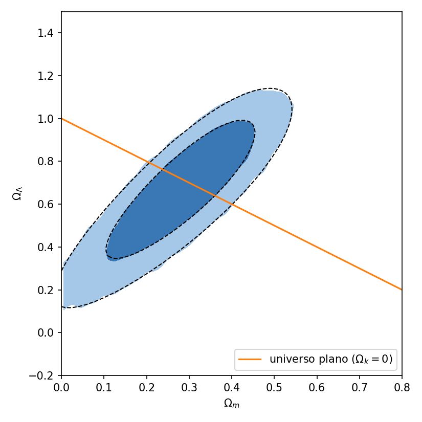

# cosmonum

Exercício 1 de Cosmologia Numérica: estimativa de $\Omega_m$ e $\Omega_\Lambda$ a partir das 580 supernovas Ia do Union2.1, com um amostrador Metropolis–Hastings escrito do zero e sem impor que o universo seja plano.

Este README traz o uso do código e as hipóteses assumidas. As contas e a justificativa detalhada de cada escolha estão nas notas do exercício (`exercicio1-notas.tex`).

Nesse repositório está tanto as notas que eu tomei estudando para fazer o código (`exercicio1-notas.tex`), quanto um rascunho do nb (`exercicio1_raschuno.ipynb`), que estão incompletos, mas são de caráter pessoal da minha trajetória na disciplina, então decidi manter.

Média e desvio padrão da posterior, com quatro cadeias de 50 000 passos:

$$\Omega_m = 0.281 \pm 0.112, \qquad \Omega_\Lambda = 0.660 \pm 0.211, \qquad \Omega_k = 0.059 \pm 0.311.$$

A mesma posterior calculada numa grade, sem cadeia, dá médias e desvios que diferem desses em menos de 0,002, e o melhor ponto da grade, $(\Omega_m, \Omega_\Lambda) \approx (0.29, 0.68)$, tem $\chi^2 \approx 545$ para 577 graus de liberdade.

## Instalação e uso

```bash
cd ~/exercicio1-cosmonum
source ~/.venvs/sci/bin/activate   # Python 3.12
pip install -e ".[dev]"           
pytest                             # 28 testes, cerca de 15 s
# analise completa, cerca de 6 min
jupyter nbconvert --to notebook --execute --inplace analise.ipynb
```

O `pip install .`, sem o `-e` e sem o `[dev]`, instala só a biblioteca, que depende apenas de numpy e scipy. O catálogo e as covariâncias vão dentro do pacote, em `cosmonum/data/` , e por isso a biblioteca acha os dados de qualquer pasta.

Distâncias e tempos num modelo FLRW qualquer, em que o tempo conforme $\eta$ é tal que $c\,\eta$ é a distância que a luz percorreu desde o Big Bang

```python
from cosmonum.cosmology import FLRW

c = FLRW(H0=70, omega_m=0.3, omega_lambda=0.7)   # omega_r=0
c.E(0.0)       # ritmo de expansao hoje, em unidades de H0 -> 1.0
c.D_L(0.5)     # distancia de luminosidade em Mpc -> 2832.94
c.mu(0.5)      # modulo de distancia -> 42.2612
c.t(0.0)       # idade do universo em Gyr -> 13.467
c.eta(0.0)     # tempo conforme em Gyr -> 46.167
c.D_L(3.0)     # ValueErro quando z acima de z_max = 2
```

Uma cadeia curta com os dados do Union2.1, que leva uns 5 segundos:

```python
import numpy as np
from cosmonum.cosmology import FLRW
from cosmonum.bayes import Posterior, GaussianRandomWalk, MetropolisHastings
from cosmonum.union21 import log_likelihood, log_prior

post = Posterior(FLRW, log_likelihood, log_prior)
proposta = GaussianRandomWalk([[0.038, 0.060], [0.060, 0.129]])
mh = MetropolisHastings(post, proposta)
rng = np.random.default_rng(1)   # a semente fixa a cadeia inteira, pode trocar se quiser

amostras, logps, aceitos, taxa = mh.sample([0.3, 0.7], 5_000, rng)
print(taxa)                          # ~0.35
print(amostras[500:].mean(axis=0))   # ~[0.28 0.66]
```

## Estrutura

```
cosmonum/
  cosmology.py    FLRW: E, H, t, eta, distancias, mu e dV/dz dOmega
  bayes.py        Posterior, Proposal, GaussianRandomWalk, MetropolisHastings
  diagnostics.py  taxa movel, autocorrelacao, tau, ESS, MCSE, split-Rhat, Dunkley
  union21.py      dados, chi2_marg, log_likelihood, log_prior
  data/           catalogo e covariancias do Union2.1
tests/            um arquivo de pytest por modulo
figuras/          figuras salvas pelo notebook
analise.ipynb     analise completa
pyproject.toml
```

Nenhum módulo importa outro. O `bayes` recebe o modelo e as duas funções de probabilidade como argumentos, e por isso o amostrador é testado numa gaussiana sem cosmologia nem arquivos de dados, enquanto a cosmologia é testada sem dado nenhum. Pelo mesmo motivo a leitura do catálogo ficou em `union21`, e usar outra compilação de supernovas é escrever outro módulo com as mesmas duas funções, `log_likelihood(theta, model)` e `log_prior(theta)`.

## Testes

Os 28 testes ficam em `tests/`, um arquivo por módulo. Cada teste que sorteia números usa a própria semente, então o resultado não depende da ordem em que eles rodam.

- `test_cosmology.py`: os quatro testes do enunciado, que são $E(0) = 1$ (também com radiação), $D_L \to cz/H_0$ quando $z \to 0$, $D_M = (c/H_0)\,\chi$ quando $\Omega_k = 0$ e $D_L = (1+z)^2 D_A$ para qualquer curvatura. Além deles, $\mu$, a idade e o tempo conforme comparados com valores de referência calculados com o astropy e com integração direta, um modelo com $\Omega_r = 9\times10^{-5}$ e o `ValueError` acima de $z_{\max}$.
- `test_bayes.py`: os três testes do enunciado, que são recuperar a média e a covariância de uma gaussiana 2D conhecida, reproduzir a mesma cadeia com a mesma semente e repetir o estado (e o $\log p$) quando um passo é rejeitado. Além deles, o `logpdf` da proposta comparado com a gaussiana do scipy.
- `test_union21.py`: dimensões e simetria da covariância, Cholesky com $LL^T = C$ e a supernova mais distante abaixo de $z_{\max}$; a diagonal da covariância  igual a $\sigma_\mu^2$; $\chi^2_{\rm marg}$ por Cholesky igual ao calculado resolvendo o sistema com $C$ inteira; $\chi^2_{\rm marg}$ inalterado ao somar uma constante a todos os $\mu$ ou ao trocar $H_0$; a fórmula fechada nunca acima do mínimo de uma varredura em $\mathcal{M}$ e a menos de 0,01 dele; $\chi^2 = 545.13$ em $(0.29, 0.68)$; e a posterior valendo $-\infty$ fora da caixa da priori, sem Big Bang e com distância inválida.
- `test_diagnostics.py`: taxa móvel; numa série AR(1) com $\phi = 0.9$, autocorrelação, $\tau$ e ESS perto dos valores exatos ($\tau = 19$); $\tau = 1$ em ruído branco; o MCSE prevendo o espalhamento das médias de 400 cadeias; o split-$\hat R$ abaixo de 1,01 em cadeias boas e acima de 1,05 com uma cadeia deslocada ou com tendência; e o ajuste de Dunkley recuperando $P_0$, $\alpha$ e $j_\star$ conhecidos e reprovando uma cadeia lenta demais.

## Hipóteses e decisões

Zero point $\mathcal{M}$. As supernovas medem a forma da relação entre distância e redshift, e a magnitude absoluta delas, junto com $H_0$, só entra como uma constante $\mathcal{M}$ somada a todos os $\mu$ teóricos. $\mathcal{M}$ é integrado analiticamente, com priori constante na reta inteira. Como $\mathcal{M}$ entra somando, o $\chi^2$ é uma parábola em $\mathcal{M}$, $\chi^2(\mathcal{M}) = A - 2\mathcal{M}B + \mathcal{M}^2 C_1$, e a integral gaussiana deixa

$$\chi^2_{\rm marg} = A - \frac{B^2}{C_1}, \qquad A = \Delta^T C^{-1}\Delta, \quad B = \Delta^T C^{-1}\mathbf{1}, \quad C_1 = \mathbf{1}^T C^{-1}\mathbf{1},$$

com $\Delta = \mu_{\rm obs} - \mu_{\rm forma}$. A covariância é fatorada uma vez só, $C = LL^T$, e os três números saem de $Ly = \Delta$ e $Lw = \mathbf{1}$, com $A = y^Ty$, $B = y^Tw$ e $C_1 = w^Tw$, sem formar $C^{-1}$. O fator $\sqrt{2\pi/C_1}$ que sobra da integral não depende de $\Omega_m$ nem de $\Omega_\Lambda$, e o mínimo da parábola é o próprio $A - B^2/C_1$, então integrar $\mathcal{M}$ ou fixá-lo no melhor valor dá a mesma posterior. O fim do notebook confere isso amostrando $\mathcal{M}$ como terceiro parâmetro, com priori constante em $[-1, 1]$ e o $\chi^2$ completo: dá $\Omega_m = 0.280 \pm 0.112$, $\Omega_\Lambda = 0.660 \pm 0.209$ e $\mathcal{M} = 0.015 \pm 0.033$, e 68,3% e 95,0% dessas amostras caem dentro dos contornos de 68% e 95% da grade com $\mathcal{M}$ integrado.

| decisão | escolha | 
|---|---|
| priori em $(\Omega_m, \Omega_\Lambda)$ | 
| curvatura | livre |
| covariância | com sistemáticas | 
| $\mathcal{M}$ | integrado analiticamente |
| $H_0$ em $\mu_{\rm forma}$ | 70 km/s/Mpc |
| $E^2 \le 0$ antes de $z = 1.414$ | recusado na priori | 
| $D_M < 0$ para alguma supernova | recusado na verossimilhança |
| grade em $z$ para $\chi$ | 1000 pontos até $z = 2$ | 
| radiação | $\Omega_r = 0$ | 
| covariância da proposta | $2.38^2/2$ vezes a covariância do aquecimento | 
| aquecimento descartado | 1000 passos por cadeia | 
| cadeias | 4 de 50 000 passos, inícios sorteados na priori | 

## Resultados

Quatro cadeias sem os 1000 primeiros passos de cada uma, somando 196 000 amostras, calculadas no `analise.ipynb`. $\Omega_k$ e $q_0$ são calculados em cada amostra a partir de $\Omega_m$ e $\Omega_\Lambda$.

| parâmetro | média ± desvio | ESS | MCSE da média | split-$\hat R$ |
|---|---|---|---|---|
| $\Omega_m$ | 0.281 ± 0.112 | 27 178 | 0.0007 | 1.0002 |
| $\Omega_\Lambda$ | 0.660 ± 0.211 | 27 087 | 0.0013 | 1.0002 |
| $\Omega_k = 1 - \Omega_m - \Omega_\Lambda$ | 0.059 ± 0.311 | | | |
| $q_0 = \Omega_m/2 - \Omega_\Lambda$ | −0.519 ± 0.166 | | | |

A correlação entre $\Omega_m$ e $\Omega_\Lambda$ é 0,84 e $\Omega_k$ é compatível com zero. Sem impor universo plano, 99,86% das amostras têm $q_0 < 0$ e 99,91% têm $\Omega_\Lambda > 0$, ou seja, os dados preferem expansão acelerada.

Nas quatro cadeias a taxa de aceitação fica entre 0,361 e 0,364 e o tempo de autocorrelação entre 6,9 e 7,8 passos. Para os dois parâmetros, o espectro de Dunkley dá $j_\star$ entre 1400 e 2000, com critério $j_\star > 20$, e $r$ perto de $2\times10^{-4}$, com critério $r < 0.01$. O split- $\hat R$ de 1,0002 fica abaixo da referência de 1,01 do enunciado.

**Figuras.** O notebook salva as figuras em `figuras/`, cada uma na seção indicada.

- `priori.png`, "Dados e posterior": regiões da caixa recusadas pela priori, sem Big Bang, e pela verossimilhança, com distância inválida.
- `aquecimento.png`, "Cadeias": os 3000 primeiros passos das quatro cadeias.
- `contornos.png`, "Contornos de 68% e 95%": contornos em $(\Omega_m, \Omega_\Lambda)$, com a posterior da grade e a reta de universo plano.
- `traces.png`, `autocorrelacao.png` e `dunkley.png`, "Diagnósticos de convergência": traços e taxa de aceitação das cadeias inteiras, autocorrelação da cadeia 0 e espectro de Dunkley com o ajuste.
- `contornos_M.png`, "Checagens das escolhas numéricas": contornos com $\mathcal{M}$ amostrado sobre os da grade com $\mathcal{M}$ integrado, e a distribuição de $\mathcal{M}$.



## Reprodutibilidade

- Ambiente `~/.venvs/sci`, com Python 3.12.3, numpy 2.4.6, scipy 1.17.1 e matplotlib 3.10.9. Os testes também passam numa instalação limpa com numpy 2.5.3 e scipy 1.18.1.
- Todo sorteio usa `np.random.default_rng` com semente explícita. No notebook, 20260913 nas cadeias principais, dividida em seis geradores com `SeedSequence.spawn`, 20260914 nas cadeias com $\mathcal{M}$ amostrado e 20260916 no sorteio da checagem da grade. Nos testes, 20260906, 42, 43 e 7 em `test_bayes.py` e de 1 a 7 em `test_diagnostics.py`.
- Rodar `analise.ipynb` do início ao fim reproduz todos os números impressos em cerca de 6 minutos, conferido em 16/09/2026.
- O catálogo (`SCPUnion2.1_mu_vs_z.txt`) e as covariâncias ficam em `cosmonum/data/`. Foram baixados em 01/09/2026 de <https://supernova.lbl.gov/union/figures/>.

## Referências

- B. Ryden, *Introduction to Cosmology*. 
- R. Trotta (2008), *Bayes in the sky: Bayesian inference and model selection in cosmology*
- R. Amanullah et al. (2010), [arXiv:1004.1711](https://arxiv.org/abs/1004.1711), apêndice C. 
- A. Gelman, G. Roberts e W. Gilks (1996), *Efficient Metropolis jumping rules*.
- Slides da disciplina, `mcmc_sampling`.
